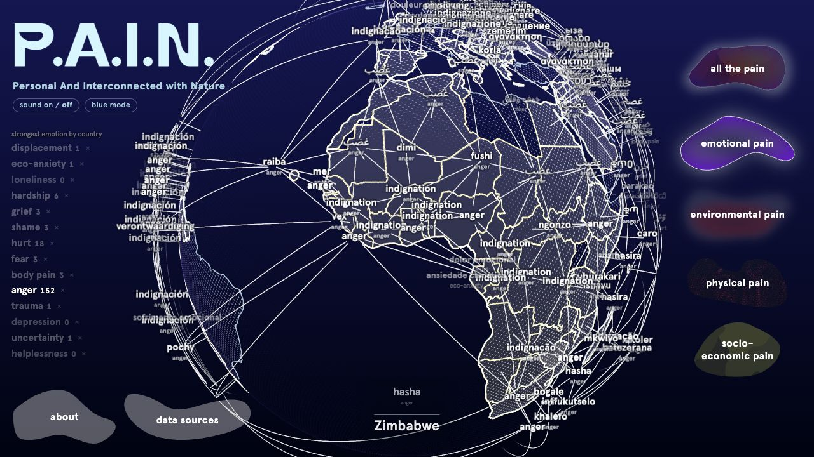

# P.A.I.N. / Understanding the project

Artist-team reference | General adult / age-18 level | English Last updated: 2026-09-09.
Version: 1.3.

This guide brings together the project's ideas, data sources, visual meanings, AI research, and
country stories. It is background material for artist members who want to understand the work
and explain it in their own words. There is no required order, script, timing, or wording.

The optional examples offer different ways to frame a topic. They can be adapted, combined, or
ignored. The factual sections remain the shared foundation; the examples are illustrations of
how a concept might be made accessible.

## At a glance

| Element | Core idea |
| P.A.I.N. | Personal And Interconnected with Nature. |
| PPP Map | Personal-Planetary-Pain Map: an artwork bringing human and environmental concerns together. |
| Four layers | Physical, emotional, environmental, and socioeconomic perspectives. |
| Visual language | Surface, atmosphere, colour, words, connection, movement, and sound. |
| Current exhibition | A selected view of the project data, including an earlier emotional analysis. |
| Main CCNews resource | About 394 million country-linked articles; about 389 million have recorded years 2015-2026. |
| Latest PCAI research | A completed analysis of 26,176,468 texts across 192 countries, explained separately. |

## The distinction that matters throughout

The artwork brings different indicators into one shared image. It does not establish one
universal unit of suffering or a ranking of whose pain matters most. A country's visible signal
is information about a particular layer, not a complete account of the people living there.

# What the artwork represents

## A shared space for different kinds of pain

P.A.I.N. means Personal And Interconnected with Nature. Its Personal-Planetary-Pain Map combines
art, AI, and network science to place human suffering beside the condition of the environments
we depend on. The project is led by Mary Maggic with collaborators in art, design, sound, data
research, technology, and the Ludwig Boltzmann Institute for Network Medicine.

The four layers offer different perspectives. The aim is to make connections available to
attention, rather than reduce all suffering to a single number. A person, a community, an
economy, and an ecosystem can be affected by the same wider circumstances while experiencing
them differently.

| What visitors see | What it represents | A useful question |
| Scarred and dotted surface | Estimated burden of painful physical conditions. | What can bodily pain change in an ordinary day? |
| Emotional words | Patterns of distress expressed in selected texts. | Whose language is present, and what might it mean? |
| Surrounding atmosphere | Temperature change and emission-related pressure. | How is this environment changing? |
| Yellow country shading | An economic dimension of hardship, based on GDP per person. | What resources and choices are available to people? |
| Connecting lines | Countries sharing a displayed emotional category, organized geographically. | What do we recognize across distance and language? |

## Physical pain: making an invisible burden visible

Migraine, back and neck pain, and arthritis can affect movement, concentration, sleep, and
participation. The marked surface gives this often invisible burden a public presence.
Population information helps explain concentrations: where many people live close together, many
lives can be affected. A strong local mark does not describe every resident.

## Emotional pain: giving distress a name

The words come from an AI's reading of selected texts. Grief, fear, anger, and hardship can
overlap even when one is prominent. A label is an opening into language and experience, not a
definition of national character.

## Environmental pain: pressure and change

The atmosphere represents warming and emissions. Warming is change over time, so a cold place
can still have a strong signal. Emissions concern pressure associated with activities. The
cloud-like image is a metaphor, not a photograph of smoke or personal exposure.

## Socioeconomic pain: the circumstances around a life

Stronger yellow means lower GDP per person. It brings economic circumstances into view while
leaving room for differences in household security, inequality, and support. Economic output is
one perspective on the conditions around people, not a complete measure of well-being.

# The visual language

The globe works as a place to look, compare, and make connections. Its appearance is an artistic
translation of information rather than a literal picture of a wound, an atmosphere, or an
emotion.

The callouts identify 1, emotional words; 2, the marked physical surface; 3, environmental
atmosphere; 4, socioeconomic yellow; and 5, the layer choices. The image shows the exhibition on
9 September 2026. The palette and emphasis can vary with the view.

The selected anger network illustrates 1, the active category; 2, connecting lines; and 3, a
country in focus. Shared words can create recognition across distance. They do not prove a
measured relationship between the people in those places.

## What each visible element communicates

| Visual element | What it represents or helps communicate |
| Dents and scar-like relief | A visible form for estimated physical health burden. |
| Dotted surface | Texture that makes the globe's bodily appearance legible; individual dots are not individual patients. |
| Red atmospheric treatment | Temperature change and warming. |
| Pale or green atmospheric treatment | Emission-related pressure, depending on the selected palette. |
| Yellow colour or hatching | An economic dimension of hardship; stronger where GDP per person is lower. |
| Words in different languages | A prominent category of distress in texts associated with the country. |
| English supporting words | A bridge for visitors unfamiliar with the chosen language. |
| Curved connecting lines | Geographic relationships within a shared emotional category. |
| Country outlines | Orientation and geographic context, not barriers confining environmental or human experience. |
| Compact country symbols | A summary of the available layer signals for a selected place. |
| Brightness and highlighting | Attention, selection, and visibility; not automatically greater suffering. |
| Blank or absent marks | Missing information or limited geographic representation, rather than an assumed zero. |

## Movement and selection

Rotation and zoom change the relationship between the viewer and the globe. Selecting a country
or emotional category brings part of the work into focus. The network animation provides a way
to follow connections from a starting place; it is not a chronology of pain spreading.

An emotional filter changes which themes are allowed to become prominent. A different category
can then appear above a country without the underlying texts changing. This offers another
perspective on the same material rather than a new measurement of the population.

## Sound and participation

The experience includes a composed background soundtrack. Some interactions also produce tones
whose character varies with the selected signal. These are artistic and interactive
representations, not recordings of somebody's pain or of the planet itself.

The related web version can offer optional personal contribution through the pain-sharing
experience. That participation is separate from the country datasets and from the latest large
PCAI analysis. Projection mode focuses on the shared map and hides the survey action. No
personal disclosure is required to engage with the artwork.

# Physical pain

## What the layer represents

The physical layer represents painful health conditions and their effects on daily life. The
marked surface gives an often invisible burden a public presence. Conditions can affect
movement, concentration, sleep, work, study, and relationships.

## Sources and size

The sources are IHME's Global Burden of Disease study and WorldPop population information.
Population data helps place country-based health information geographically. The exhibition
contains 15,282 mapped observations across six categories, with 2,547 per category. These are
map observations, not counts of patients interviewed for the artwork. [S7-S8]

| Condition | Meaning in ordinary terms |
| Headache disorders | A broad group of conditions involving recurring headaches. |
| Migraine | A neurological condition often involving recurring headache and other symptoms. |
| Low back pain | Pain in the lower back that can limit movement and everyday activity. |
| Neck pain | Pain around the neck that can affect comfort, movement, and activity. |
| Osteoarthritis | A joint condition associated with pain, stiffness, and reduced function. |
| Rheumatoid arthritis | An immune-related inflammatory condition affecting joints and other tissues. |

The categories are not necessarily separate groups of people. For example, migraine belongs
within the wider subject of headache disorders, so the two appearances should not be added into
a count of unique patients. [C3, C5-C7]

## Why population matters

Many people living close together can create a concentration of health burden even without
unusually high risk for each individual. Population-based placement is therefore part of the
explanation for strong marks near dense urban regions, including part of India.

The compact country symbol emphasizes a strong local signal rather than a national average. A
country contains many different places and experiences. A high local mark does not describe the
condition of every resident.

## What is established and what remains open

The exact health reference year and original measure still require confirmation. Relative
patterns can be discussed, but the visual marks do not provide directly readable clinical rates,
patient counts, or individual diagnoses.

## Optional framing examples

- Everyday experience: "The scars make an often invisible health burden visible."
- Population perspective: "Where many people live, a large burden can be concentrated."

# Environmental pain

## Two different dimensions

The environmental layer brings temperature change and emissions into the same atmosphere around
the globe. They belong in one environmental conversation, but they represent different
quantities.

| Dimension | Source | Observations used | Central meaning |
| Temperature change | Berkeley Earth | 8,100 | How a place's temperature has changed relative to an earlier climate. |
| Emission-related pressure | Climate TRACE | 2,339 | Pressure associated with emissions from activities. |

## Warming is not the same as heat

A cold place can warm substantially while remaining colder than a tropical place. Russia and
Canada are useful examples in this exhibition. Regional climate research describes amplified
Arctic warming through interacting processes, including changes in snow and ice reflectivity.
This is relevant context, rather than an explanation of every individual mark. [S9, C1]

The red atmospheric treatment makes change perceptible. It should not be read as today's weather
or as a uniform condition throughout a country. The exact comparison period and reference
climate behind the exhibition's temperature observations remain to be confirmed.

## Emissions are not the same as exposure

Climate TRACE estimates emissions across activities, gases, and time periods. The exhibition's
atmospheric form gives emission-related pressure a visual presence. It is not a photograph of
smoke, a measured cloud height, or a direct indication of what a nearby person breathes. [S10]

The exact gas measure and reference period behind this selected view still require confirmation.
In particular, carbon dioxide and carbon-dioxide-equivalent totals are not identical quantities.
The artwork supports relative interpretation without supplying a justified conversion of its
colour into tonnes or personal exposure.

## Why the atmosphere matters artistically

The atmosphere extends around country boundaries. It can help express that environmental
processes connect places while many activities and decisions are situated locally. The form
makes a dispersed concern available to shared attention.

## Optional framing examples

- Climate perspective: "A place can still be cold while changing quickly."
- Everyday perspective: "Weather is what we meet today; this layer asks about change over time."
- Artistic perspective: "The atmosphere makes pressure around the planet perceptible."

# Socioeconomic pain

## What the yellow represents

The socioeconomic layer uses World Bank GDP per capita for 2024, in current US dollars per
person. Stronger yellow means lower economic output per person. This is an artistic proxy for
one dimension of economic hardship. [S11]

GDP measures production within an economy. Dividing by population gives a per-person comparison;
it does not reveal a typical salary, household income, wealth distribution, or the support
available to a particular person.

## Source facts

| Fact | Detail |
| Source | World Bank GDP per capita. |
| Reference year | 2024. |
| Unit | Current US dollars per person. |
| Coverage in the exhibition roster | 190 available values and 16 missing entries. |
| Visual direction | Lower GDP per person gives stronger yellow. |
| Scale | Logarithmic, so a very wide economic range remains visible. |

The logarithmic scale changes how economic differences are displayed; it does not adjust for
inequality or local purchasing power. No calculation is needed to understand the visual
direction.

## Interpreting country contrasts

Burundi sits at the low-output end of the selected comparison and Monaco at the high-output end.
Luxembourg illustrates how economic structure matters: cross-border workers contribute to
production while living outside its resident population denominator. These cases can clarify an
economic indicator without turning it into a complete portrait of well-being. [C2, C4]

Economic resources may affect the choices available around a life, but they do not describe
affection, dignity, security, fair distribution, or personal suffering on their own. Different
people within one country can experience very different circumstances.

## Optional framing examples

- Economic perspective: "Yellow shows one part of the circumstances around people's lives."
- Plain explanation: "A national average cannot tell us how resources are shared."
- Artistic perspective: "The colour invites a question about what support and choices a place makes possible."

# Words and connections

## Shared categories across different languages

The emotional layer includes 14 broad categories. The words shown to visitors are short openings
into wider meanings. For example, anger includes outrage at perceived wrongdoing; grief includes
distress over changes to a home environment; and hardship includes loss and insecure
circumstances. One country may have many relevant themes even though the artwork gives one
prominence.

| Category | A visitor-friendly meaning |
| Body pain | Language expressing physical hurt. |
| Hurt | Emotional suffering that is not more specifically named. |
| Eco-anxiety | Fear or anxiety about environmental change. |
| Uncertainty | Distress connected to instability and an unclear future. |
| Grief | Loss, mourning, and distress over a changed home environment. |
| Anger | Anger, outrage, and hurt associated with perceived wrongs. |
| Hardship | Loss, insecurity, and difficult material circumstances. |
| Displacement | Distress linked to exile or being uprooted. |
| Trauma | Experiences described through trauma or overwhelm. |
| Loneliness | Relationship and social pain. |
| Depression | Language of depressive distress; the research category includes more severe forms too. |
| Fear | General fear, anxiety, and panic. |
| Helplessness | Feeling unable to influence what is happening. |
| Shame | Shame, guilt, and self-blame. |

These are categories used to interpret texts, not diagnoses of visitors or populations.
Translation also has limits: one chosen language cannot represent everybody in a multilingual
country, and a brief English gloss may leave out important associations.

## Why the lines connect

Countries sharing the same displayed category are connected according to geographic proximity.
This gives a readable shape to a shared theme across distance. It can help a visitor recognize a
familiar concern somewhere unfamiliar without implying that the places have the same history.

The current exhibition uses a Delaunay network, linking neighbouring places into a mesh of triangles. Gabriel is a related, sparser proximity network
explored by the project. A simple way to understand Gabriel is to imagine a circle spanning two
places: another place inside that circle can remove their direct connection. On a globe, the
same idea is applied in three dimensions. The diagram shows the idea rather than a map of actual
countries.

[[DIAGRAM:graph]]

The network is not a record of pain travelling between countries. Its animation follows a
selected starting point so the eye can follow the connections. Changing an emotional filter can
bring a different shared theme forward, giving a different route through the same collection of
places.
# PCAI / The latest AI and research

## What PCAI contributes

PCAI brings together and prepares texts that can be associated with countries. The classifier
looks for language expressing physical, emotional, and social distress. This lets the project
explore far more material than a person could read during an exhibition visit while retaining
several different kinds of source.

The AI is an interpreter of language. It is not reading minds, diagnosing populations, or
measuring the private feelings of everyone in a country. Its categories can overlap because a
passage can express several kinds of distress at once.

## The latest classifier

The current adopted PCAI classifier, version 9, was finalized on 4 September 2026. It uses BGE-M3, a pretrained
multilingual language encoder, followed by a smaller neural network trained for this project.
The encoder creates a numerical description of meaning; the smaller network learns which
descriptions are associated with the project's categories. BGE-M3 itself was not trained from
scratch on the project's examples. [S12]

For readers who want the model detail, the smaller network has a hidden layer of 1,024 units. It
produces 70 related decisions, organized as three decisions about whether distress is relevant,
14 broad groups, 47 more specific forms, two safety-related signals, and four reasons a passage
may be outside the task. These are not 70 different emotions. Safety-related signals flag
language; they are not clinical diagnoses.

The model can identify several themes in one text. Broad relevance also affects how specific
category scores are interpreted. It examines at most 512 tokens per record. Tokens are pieces of
text, not always whole words, so long articles may lose context from their later sections. This
is one of the practical limits on what the model has actually read.

## What taught the model?

The teaching examples are synthetic: they were constructed to express known kinds of distress in
varied language. They are separate from the real news articles, social posts, and complaints
analysed afterward. A collection of synthetic examples should never be described as that many
people reporting pain.

| Stage | Number of examples | Meaning |
| Complete prepared collection | 573,143 | The broader teaching resource, spanning 100 languages. |
| Examples used to fit the adopted classifier | 333,236 | The cleaned subset that actually taught the smaller network. |
| Clean synthetic test | 15,874 | Withheld examples used to evaluate the model. |
| Withheld synthetic stress test | 10,429 | A harder comparison using challenging examples. |

The fitted subset contains 295,572 current-generation examples and 37,664 earlier reviewed
examples. Older mapped-label material was excluded from the adopted recipe. The prepared
collection therefore has a different size from the material actually used to fit the model. Some
evaluation resources are separate products; the rows above should not be added into one total.

The programme includes 100 languages, but that does not establish equally reliable results
across all of them. Language coverage, training quality, and demonstrated accuracy are three
different questions.

## How well did it perform in evaluation?

| Evaluation | Broad-category macro-F1 | More specific category macro-F1 |
| Clean synthetic test | 0.9028 | 0.7772 |
| Withheld synthetic stress test | 0.6658 | 0.6552 |

F1 balances recognizing labelled examples with avoiding false alarms. Macro means each category
contributes equally to the average, including less common ones. The lower result on the stress
test shows that difficult forms and combinations of language remain challenging.

A score near 0.90 does not mean the system is 90 percent accurate about how people feel. Both
evaluations use synthetic material. They do not establish national emotional prevalence or the
model's error rate across every real-world language and source. The completed real-text runs
remain exploratory research results in that sense.

## CCNews: the main news collection

CCNews is a large international collection of news gathered through Common Crawl and prepared by
Stanford OVAL. The upstream source is described as containing approximately 600 million articles
in more than 100 languages. It is already a curated news collection: its source description
includes text cleaning, duplicate removal, and language detection. [S1]

PCAI began from this source and built a locally counted snapshot of 474,985,436 records, about
475 million. After further preparation and filtering, the main country-linked news corpus
contains 393,745,301 articles across 186 publisher countries. This is the roughly
400-million-article resource behind the broader classification programme.

The approximate 600 million and the exact local totals describe different stages. The source
description is not an exact count of the project's downloaded snapshot, so the gap between them
should not be presented as a precise number of articles removed by PCAI.

## The collection at different stages

| Stage | Articles or records | Meaning |
| Upstream Stanford OVAL source | About 600 million | The broader international source collection. |
| Locally acquired snapshot | 474,985,436 | The collection actually counted when brought into the project. |
| Prepared text collection | 472,438,058 | After initial duplicate/date checks and a later privacy-cleaning pass. |
| Linked to a supported publisher country | 394,231,021 | Records with usable, non-conflicting country attribution. |
| Main corpus ready for classification | 393,745,301 | After final text/privacy eligibility and duplicate checks. |
| Its recorded-year 2015-2026 slice | 388,842,327 | A date-focused subset of the same main corpus, not an extra collection. |

The main corpus also contains 4,902,974 records with recorded years 2010-2014. Together these
make 393,745,301. The 2015-2026 figure is often rounded to about 400 million when discussing the
project's main news resource. It is important to retain its meaning as a subset rather than add
it to the larger total.

These are recorded source years. A date can come from article metadata, crawl information, or an
acquisition-time substitution when another usable date is unavailable. The presence of a 2026
date does not by itself establish fresh 2026 reporting. The current dated collection has no 2025
entries.

## What the filtering does

| Preparation step | Purpose | Relevant scale |
| Readable, comparable text | Standardize characters, spacing, and escaped symbols so equivalent text can be recognized. | Applied to the local snapshot. |
| Initial duplicate and date checks | Remove repeated material and records outside the supported date rules. | 906,602 duplicates and 1,640,769 date exclusions. |
| Reduce identifiable details | Mask detected email addresses and telephone numbers; later checks also mask links and user handles. | Most masking changes text without discarding the article. |
| Establish publisher country | Use publisher reference information and supported country-domain evidence; leave unresolved or contradictory assignments out. | 78,207,037 records excluded from the country-linked view. |
| Retain usable, eligible prose | Require enough readable text and consistent record information after privacy preparation. | 485,075 records excluded across these checks. |
| Final duplicate and conflict checks | Prevent repeated sanitized content from being counted again as independent country evidence. | A further 645 records excluded. |

The initial duplicate and date checks leave 472,438,065 records. Seven additional duplicates
became apparent after later privacy cleaning, leaving the prepared-text total of 472,438,058.
Publisher-country checks retain 394,231,021; final eligibility and duplicate checks leave the
main 393,745,301.

The initial supported date rules are not the same as the later 2015-2026 view. In particular,
the main corpus still retains some earlier records. Likewise, the 485,075 eligibility exclusions
cannot all be described as private or harmful articles: that total combines several text and
record checks.

Privacy masking reduces recoverable identifiers; it does not prove that every possible
identifying detail has disappeared. Duplicate removal reduces repeated content, but different
articles can still discuss the same event. These preparations improve the material available for
analysis without making it a representative sample of everybody's experience.

## What is not filtered out in advance

The main CCNews corpus is general news, not a preselected collection of painful stories.
Articles are not required to contain a pain keyword to enter this news collection. The
classifier subsequently assesses whether distress is relevant and which themes are expressed.

The acquired and prepared collections contain 116 recorded language codes. Language metadata
helps organize the source; it does not guarantee equal amounts of material or equally reliable
model performance in every language. Publisher output, crawler reach, language coverage, and the
ability to establish a publisher's country all shape what is retained.

Country still means the publisher's organizational origin. The filtering does not turn that into
the location of the reported event, the nationality of the author, or a direct observation of
residents' feelings. Excluding unresolved publishers can itself change which voices are
represented.

## Main corpus and classification progress

The main corpus is prepared for the broader, ongoing classification programme. Preparation of
the collection and completion of its AI analysis are separate milestones. The latest recorded
operational state checked for this guide does not establish that a full 393.7-million-article
production run has started; no live progress percentage is claimed for it here.

The verified completed news classification covers 25,932,030 articles selected from within the
main corpus, with up to 250,000 per country and attention to recorded-year coverage. The main
corpus has no such per-country cap. The 25.9-million subset is part of the 393.7-million corpus,
so those numbers must not be added together.

The completed analysis below combines that 25.9-million news subset with five smaller text
sources. It supplies the latest verified results discussed in this guide. The larger corpus
provides the wider research resource; completion of the smaller run does not mean the entire
resource has been classified.

## The latest completed classifier run

The latest large news classification was completed and summarized by 8 September 2026. It
analysed 25,932,030 selected news articles, then combined the results with 244,438 records from
five expression sources. The completed combined analysis contains 26,176,468 records and has
observations for 192 countries.

This was an application of the adopted classifier to real material, not a new training run. It
is also a large selection from a much bigger news archive, not every article in the archive. The
news selection sought up to 250,000 articles per country; 86 countries reached that target.

| Source | Records analysed | Countries represented |
| Stanford OVAL CCNews | 25,932,030 | 186 |
| Twitter Sentiment by Country | 166,837 | 163 |
| DEMOTEC participatory-budgeting tweets | 67,193 | 136 |
| Yachay coordinate-linked texts | 8,564 | 4 |
| CFPB consumer complaints | 1,030 | 1 |
| CMU GeoText microblogs | 814 | 1 |
| Combined | 26,176,468 | 192 |

Country coverage overlaps, so the country counts cannot be added. Records are not unique people,
and different articles or posts can refer to the same event. The five smaller sources together
contribute 244,438 records across 175 countries. [S1-S6]

## What each source adds

Stanford OVAL CCNews supplies published news from the source collection described above. The
completed analysis uses 25.9 million articles selected from the larger 393.7-million main corpus.
News gives a view of what publishers cover and how events are described. It is not a
representative interview with residents. [S1]

Twitter Sentiment by Country contributes social posts with supplied country context. The
analysed selection contains 166,837 records with recorded year 2020. The source provides country
context rather than proof of each author's nationality or residence. [S2]

DEMOTEC contributes 67,193 tweets concerning participatory budgeting and civic participation,
with recorded years 2015-2021. Its topic-based collection makes it a particular view of public
discussion, not a general sample of all emotion. [S3]

Yachay contributes 8,564 texts with geographic context, with recorded years 2014-2022. The
broader source is described as containing more than 600,000 posts focused on six countries; the
analysed selection reaches four country contexts. [S4]

CFPB contributes 1,030 consumer complaints with recorded year 2025. Complaints make problems
visible, but their purpose naturally differs from ordinary conversation or general news. [S5]

CMU GeoText contributes 814 geotagged microblog records with recorded year 2010. This older
collection adds another type of geographically associated language rather than a current
national survey. [S6]

## Languages, dates, and country meaning

The latest news selection contains 104 recorded language or variety hints. The five largest are
English, Spanish, Arabic, French, and Russian. A hint is information about likely language; it
is not proof that the classifier works equally well for that language.

| Recorded news language hint | Articles |
| English | 6,335,174 |
| Spanish | 4,489,844 |
| Arabic | 2,268,925 |
| French | 1,658,090 |
| Russian | 1,283,339 |

Country coverage does not guarantee balanced local-language coverage. For example, the
collection contains very few records identified as Chinese or Japanese despite including
country-associated news from those places. This matters when interpreting a label as if it
represented a country's own diverse voices.

About 94.2 percent of the latest news selection carries recorded years 2017-2024. The dates are
historical and uneven, with a small number outside that range. These are recorded source dates,
not an independently verified chronology for every article. The analysis should not be presented
as a real-time picture of national emotion.

All selected news articles are assigned by publisher country. An article associated with India
can therefore be a report by an Indian publisher about events elsewhere. The smaller sources use
their available geographic context, such as a supplied country, profile location, or associated
coordinates. None of this is interchangeable with asking a representative sample of residents
how they feel.

## How the latest results are combined

The latest combined analysis gives one equal contribution to each record. A country's result is
the average of its available text scores, not an average of its residents. Because the news
collection is much larger, news supplies about 99.07 percent of all records globally. Its share
differs between countries.

This is a substantive change from the earlier exhibition selection, which gave a news average 75
percent of the weight and an expression average 25 percent where both were available. The newer
analysis changes both the scale of evidence and the relative influence of different source
types. More records do not automatically mean more balanced voices.

## What the latest run found

Anger or moral injury is the strongest broad category in 178 of the 192 combined country
results. It leads in 174 of the 186 news-only country results and 124 of the 175 expression-only
results. These findings concern the model's interpretation of the collected texts, not the
emotional character of national populations.

The pattern could reflect topics, selection of publishers, source composition, language
differences, or model tendencies. The current analysis does not establish the separate causal
contribution of each. A view that excludes anger reveals the next strongest themes, but does not
establish that anger is absent.

| Latest research example | Records associated with the country | Strongest broad theme |
| India | 251,442 | Anger/moral injury, average model score 0.2466. |
| Japan | 251,096 | Anger/moral injury, average model score 0.1752. |
| United States | 258,375 | Anger/moral injury, average model score 0.1698. |

These are average model scores, not percentages of people. India includes 250,000 news articles
plus 1,442 expression records; its large total therefore remains overwhelmingly
publisher-associated news. The United States includes additional complaint and microblog
material, which gives it a somewhat different source mixture.

Countries with other leading themes include Iceland, with unspecified emotional pain; Saint
Vincent and the Grenadines, with grief; Tonga, with fear; and Samoa, with hardship. These
describe the latest analysis and should not be substituted for the labels in an older exhibition
view.

## Latest research and the visible exhibition

| View | Text records | What this view represents |
| Earlier selection currently displayed | 249,438 | This supplies the words and emotional examples visible in the projection. |
| Latest completed combined analysis | 26,176,468 | This is the project's newer, larger research result, discussed in this chapter. |

The earlier selection uses 5,000 news articles together with the same 244,438 expression
records. With all categories enabled, anger leads in 152 of its 192 observed countries. In the
newer analysis it leads in 178. The two figures answer questions about different selections and
different source weighting.

Comoros, Micronesia, and Guinea-Bissau have no available emotional observation in the completed
combined inputs. Absence of a result means missing evidence in this collection, not absence of
suffering. The country stories that follow describe the exhibition as currently shown; this
chapter is the place for the newer research results.
# Country stories / 25 ways into the exhibition

Each entry records a country observation, its meaning, and relevant context. These are resources for understanding the exhibition and developing an explanation, not passages to perform. Country examples refer to the current exhibition unless explicitly identified as wider context. High and low concern the named layer, not an overall ranking of suffering.

## Story 01 / India: many lives in one place

**Observation:** India has a strong local physical signal, including a migraine-related
concentration.

**Interpretation:** India's strong physical mark invites us to think about concentration. Where many people
live close together, a large health burden can be concentrated too. The physical layer uses
population information, so this is part of the explanation for its intense appearance.
Migraine-related pain is prominent in the strong local signal. Imagine the ordinary activities
recurring pain can interrupt: study, work, travel, and caring for somebody else. The mark
represents a collective burden while leaving each person's experience distinct.

**Context:** A large concentration of burden is different from a high risk for every
individual. The layers offer distinct perspectives on India, not a single national pain score.

## Story 02 / Pakistan: the weight of recurring headaches

**Observation:** Pakistan has some of the strongest headache-related signals in this exhibition.

**Interpretation:** Pakistan has some of the strongest headache-related signals in the physical layer. A
headache can sound minor until we consider repeated interruptions to concentration, work, sleep,
and participation. WHO describes headache disorders as an important cause of disability. The
globe makes that often invisible burden available to shared attention. It also invites us to ask
whether familiar symptoms receive the recognition and care their effects on everyday life
deserve.

**Context:** Migraine and the wider headache category are related; their appearances
should not be added into a count of different patients. [C7]

## Story 03 / Japan: mobility, age, and independence

**Observation:** Japan has a strong back-pain signal; its older population is relevant
contextual information.

**Interpretation:** Japan's strong back-pain signal is a way into a conversation about mobility and
independence. Almost three in ten people in Japan were aged 65 or older in 2024. WHO identifies
age as relevant to the global burden of back pain. That is useful context, rather than a
complete explanation of the country's mark. We can ask what it means to live longer while
maintaining the ability to move, meet people, and take part in everyday life, and how care can
support that independence.

**Context:** Japan population context: 29.3 percent aged 65 or over in 2024. This does
not establish how much age explains the exhibition signal. [C3, C8]

## Story 04 / China: different kinds of joint pain

**Observation:** China has strong signals associated with osteoarthritis and rheumatoid
arthritis.

**Interpretation:** China has strong arthritis-related signals. The shared word arthritis covers different
conditions: osteoarthritis affects the joint and is associated with factors including age and
injury; rheumatoid arthritis involves immune-related inflammation. Both can make ordinary
movement difficult. The country example is an invitation to notice how a small movement, such as
walking or using a hand, supports many parts of a life. A physical mark can bring that
dependence on movement into view.

**Context:** The contrast illustrates different conditions; it does not diagnose individuals from a country colour. [C5-C6]

## Story 05 / Egypt: an ordinary movement we rely on

**Observation:** Egypt has a strong neck-pain signal in this view.

**Interpretation:** Egypt has a strong neck-pain signal in the exhibition. Turning the head, reading,
looking around during a journey, and working at a desk may be actions we barely notice when they
are comfortable. Pain can make them demanding. This story begins with the familiar body rather
than a distant national statistic: what do we take for granted about being able to move and
direct our attention? The map brings a usually private limitation into public view.

**Context:** The exhibition does not establish a specific occupational or lifestyle
cause for Egypt's strong signal.

## Story 06 / United Kingdom: pain behind an ordinary appearance

**Observation:** The United Kingdom has a strong rheumatoid-arthritis signal.

**Interpretation:** The United Kingdom has a strong rheumatoid-arthritis signal. This condition can involve
pain, swelling, and limitations that are not always apparent to somebody looking from outside.
The scarred globe gives a visible form to the idea that much bodily suffering goes unrecognized.
It can start a conversation about the difference between appearing well and having the energy
and movement needed for an ordinary day.

**Context:** Rheumatoid arthritis involves immune-related inflammation; the map is not
assessing individual visitors. [C6]

## Story 07 / Guyana and Vanuatu: a quiet mark still leaves a story

**Observation:** Guyana and Vanuatu have low observed physical signals in this view.

**Interpretation:** Guyana and Vanuatu have low physical signals in this view. A quieter mark can tempt us
to look away, but it is not a complete account of health. The artwork represents selected
conditions, and people experience many kinds of pain beyond what any one image can contain.
These examples encourage a useful habit: notice what is quiet as well as what is bright, and
leave space for experiences that may be poorly represented.

**Context:** Low visible signal should not be narrated as proof that people there have
little suffering.

## Story 08 / Russia: cold does not mean unchanged

**Observation:** Russia has a strong temperature-change signal despite its association with cold
climates.

**Interpretation:** Russia can look strongly affected in the warming layer even though many visitors
associate it with cold. Warming describes change, not simply whether a place feels hot. Arctic
research identifies interacting reasons for amplified change, including what happens as snow and
ice retreat. A landscape can remain cold while important parts of its climate and environment
change. The globe makes that difference between a familiar image and a changing reality easier
to notice.

**Context:** Regional climate science is relevant context; a national outline contains
many different environments. [C1]

## Story 09 / Canada: a landscape with a changing history

**Observation:** Canada also has a strong temperature-change signal.

**Interpretation:** Canada offers another example of a cold place with a strong warming signal. A familiar
landscape can carry a changing environmental history that is not obvious during a short visit.
This layer asks us to look beyond one day's weather and consider what change may mean for
places, ecosystems, homes, and ways of living. The country is large and diverse, so the mark
should lead us towards local questions rather than a single story for every community.

**Context:** The signal emphasizes strong local change rather than a uniform
experience throughout Canada. [C1]

## Story 10 / Uruguay: a faint signal is a specific statement

**Observation:** Uruguay is at the low end of the observed temperature-change view.

**Interpretation:** Uruguay sits at the low end of the exhibition's temperature-change view. It is a useful
reminder to name what a layer represents. This is a particular warming comparison, not a summary
of every environmental issue or a promise about the future. A low mark in one dimension may sit
beside very different circumstances in another. Different layers offer different information about the same place.

**Context:** The observed temperature signal is zero in this view; avoid describing
Uruguay as untouched by climate change.

## Story 11 / Iceland: different ways to know a cold place

**Observation:** Iceland has a small temperature-change signal in this particular comparison.

**Interpretation:** Iceland's low temperature signal in this view is a good place to distinguish what we
imagine about a country from what a specific indicator shows. Climate, weather, landscape, and
environmental vulnerability are related but different subjects. One small mark cannot stand in
for all of them. The story is about curiosity: when an image surprises us, we can ask which
aspect of the place it is showing and what a fuller picture would include.

**Context:** A low result in this comparison is not a general climate verdict.

## Story 12 / Russia: emissions beyond the border

**Observation:** Russia has a strong local emission-related signal.

**Interpretation:** Russia also has a strong emissions signal. Here the atmosphere points towards a
different concern from temperature change: emission-related pressure associated with activities.
A country's border helps us locate a place, but environmental processes are not confined by that
outline. The surrounding form invites us to think about the relationship between local
activities and a shared atmosphere, rather than imagining each country as an isolated
environmental container.

**Context:** This is a strong local emissions signal, not a ranking of national totals
or personal exposure. [S10]

## Story 13 / Iran and Iraq: energy, activity, and atmosphere

**Observation:** Iran and Iraq both have strong emission-related signals in this view.

**Interpretation:** Iran and Iraq both have strong emissions signals in this view. The cloud-like treatment
can open a conversation about the activities that support economies and everyday life, and about
the environmental pressures connected with those activities. It also reminds us that countries
share an atmosphere. The artwork makes those pressures visible enough to ask about; identifying
the contribution of a particular industry would need more specific evidence.

**Context:** A visual mark alone does not identify a facility or sector. [S10]

## Story 14 / Guinea-Bissau: looking beyond the bright places

**Observation:** Guinea-Bissau is near the low end of the emissions view.

**Interpretation:** Guinea-Bissau is near the low end of the emissions view. It offers a quieter starting
point than a dramatic hotspot. A low emissions signal is not the same thing as freedom from
environmental vulnerability, because the pressure a place produces and the changes it
experiences are different questions. That distinction matters when considering emissions alongside warming.

**Context:** Emissions, environmental effects, and the air a person breathes are
different quantities.

## Story 15 / Burundi: resources and the possibilities around a life

**Observation:** Burundi has a strong yellow signal because of low GDP per person in the
comparison.

**Interpretation:** Burundi has a strong yellow signal because it has low GDP per person in this
comparison. The World Bank describes an economy facing development constraints, including
low-productivity agriculture and landlocked geography. This is relevant context for the economic
indicator. The human question is what resources make possible: security, access to services, and
choices when circumstances change. The yellow layer introduces that question without claiming to
describe every household or the experience of every resident.

**Context:** GDP per person represents economic output; it does not measure individual
suffering. [C2, S11]

## Story 16 / Luxembourg: what a prosperous-looking number contains

**Observation:** Luxembourg has a weak yellow signal because of high GDP per person.

**Interpretation:** Luxembourg has a weak yellow signal because its GDP per person is high. Its economy
illustrates why the meaning of that figure matters. Cross-border workers contribute to
production, while living outside the resident population used in the per-person comparison. A
prosperous-looking national number is therefore not a typical resident's salary. This example
opens a conversation about how an economy works and whose circumstances an average can or cannot
describe.

**Context:** The accounting explanation comes from Luxembourg's national statistics
office. [C4]

## Story 17 / Monaco: economic strength and emotional life

**Observation:** Monaco has the weakest yellow signal and still has an emotional word in the
artwork.

**Interpretation:** Monaco is at the high-output end of the economic comparison, with the weakest yellow
signal. It also has an emotional word in the artwork. That is not a contradiction. Economic
resources and emotional suffering describe different dimensions of life. This is a clear way to
show why the layers belong together without being interchangeable: one may illuminate material
circumstances while another opens a conversation about language, relationships, and experience.

**Context:** A very low yellow signal does not mean an absence of pain.

## Story 18 / India: the size of an economy and the lives within it

**Observation:** India illustrates the difference between total economic size and output per
person.

**Interpretation:** India allows us to distinguish the size of a country's economy from economic output per
person. The yellow layer uses the second idea. A large total economy can still contain very
different material circumstances across a large population. The artwork invites us to consider
the conditions around people rather than the scale of national production alone. It also leaves
an important question open: how are resources shared among the people within that outline?

**Context:** The selected indicator is GDP per person in 2024, not total GDP or a
poverty percentage. [S11]

## Story 19 / Yemen: a blank is not a reassuring answer

**Observation:** Yemen has no GDP observation in this selected view.

**Interpretation:** Yemen has no economic observation in this selected view. The appropriate reading is
that this piece of information is unavailable, not that economic hardship is absent. Another
layer may still contain a word or a signal. This is a useful way to explain that each source
reaches different places in different ways. A blank should invite a question about the evidence,
rather than a confident story about the country.

**Context:** Missingness belongs to a particular source and view, not to the whole
reality of a place.

## Story 20 / Burundi: anger as a word of concern

**Observation:** Anger is prominent for Burundi in the earlier exhibition selection.

**Interpretation:** Burundi's prominent anger label can lead us to consider what anger means in this
project. The category includes outrage and moral injury, so it can involve a response to
something perceived as unjust. That is different from labelling a people as aggressive or angry.
The exhibition's word comes from selected texts, with limited evidence for some countries. It
should encourage curiosity about the concerns described, not turn into a judgement about
national character.

**Context:** The latest PCAI chapter explains why source size and the choice of texts
matter to emotional comparisons.

## Story 21 / Palau: one word cannot speak for everybody

**Observation:** Palau's earlier exhibition result is based on a very small news selection.

**Interpretation:** Palau is a powerful example of the gap between a visible word and a whole population.
Its earlier exhibition result draws on a very small news selection. The word we see is an
opening into that material, not a conclusion about everyone who lives there. When a place looks
calm, uncertain, or distressed on a map, it is worth asking whose language supplied that
impression and whose experience may not have reached the image.

**Context:** This story refers to the earlier exhibition selection. The detailed AI
chapter keeps it separate from the larger latest run.

## Story 22 / Timor-Leste: a strong word can have several meanings

**Observation:** Timor-Leste has a strong anger theme in the earlier exhibition selection.

**Interpretation:** Timor-Leste's strong anger theme in the exhibition can open a conversation about how
one emotional word contains different experiences. Anger may concern loss, insecurity,
injustice, or a specific disagreement. A country label does not tell us which of those
experiences is shared by its residents. We can use the word to begin listening and learning,
rather than taking it as the end of the explanation.

**Context:** The earlier exhibition evidence for this country is small. That small selection does not establish national causes.

## Story 23 / Sao Tome and Principe: climate concern in language

**Observation:** Sao Tome and Principe has an eco-anxiety label in the exhibition.

**Interpretation:** Sao Tome and Principe brings eco-anxiety into view. This category concerns fear and
anxiety expressed about environmental change. It is different from a climate sensor: the words
tell us about language in the selected material, while the environmental layer concerns physical
indicators. Looking at the two together can help us discuss the difference between a changing
environment and the ways people describe concern about it.

**Context:** The exhibition label comes from publisher-linked news; it does not
measure the population's anxiety.

## Story 24 / Oman: body pain expressed in words

**Observation:** Oman's emotional label is body pain, derived from language rather than the
health layer.

**Interpretation:** Oman's emotional label is body pain. It belongs to the language layer, where the AI
recognizes descriptions of bodily hurt. The scarred physical layer comes from a different
source: health estimates. That distinction is useful because experience can appear in more than
one form of evidence. A medical estimate and a passage about pain may both matter, while
answering different questions about the same broad concern.

**Context:** Related words do not make the emotional and physical layers the same
measurement.

## Story 25 / Comoros: visibility depends on the source

**Observation:** Comoros has economic information but no observation in the selected emotional
collection.

**Interpretation:** Comoros has economic information in the exhibition but no observation in its selected
emotional collection. This is a reminder that visibility depends on the source we are looking
through. A place can appear in one view and be absent from another. The response should be
curiosity about whose experiences and information are available, not an assumption that there is
nothing important to say about the place.

**Context:** Different layers have different coverage. Missing information is not
absence of suffering.
# Optional ways to frame the ideas

These examples illustrate different emphases. They are not instructions or approved lines that
anybody has to repeat. A person explaining the artwork can use their own language, select a
useful comparison, or begin from a visitor's question.

| Emphasis | Example framing | What it brings forward |
| Everyday life | "What can change in a person's day when movement or concentration becomes difficult?" | Bodily experience and participation. |
| Scientific meaning | "Each layer is a different kind of evidence about a place." | The sources and the limits of comparison. |
| Artistic meaning | "The globe lets us look at what the world carries." | Metaphor and shared attention. |
| Social context | "Resources affect possibilities, but an average cannot describe every life." | Economic circumstances and inequality. |
| Connection | "A familiar word can appear in a language we do not know." | Recognition across language and distance. |

## Examples for a younger child

The purpose of these examples is to show possible levels of explanation, not to turn the adult
reference into a child-facing script. A fuller age-5 resource can offer more concrete
comparisons and alternative wordings while keeping the same factual foundation.

- People and planet: "This globe helps us think about looking after people and the places they live."
- Different layers: "We can look at different kinds of hurt and worry, one at a time."
- Words: "These words help us talk about feelings. They do not tell us how every person feels."
- Connections: "Places far apart can have something in common."
- Care: "What helps a person, a home, or a place feel cared for?"

Young children do not need model architecture or large record counts to engage with the central
idea. Concrete examples, room for questions, and the distinction between a picture and a real
person's experience can carry the meaning.

## How emphasis can vary without changing the facts

A poetic framing can foreground relation and care. A science-oriented framing can foreground the
type of evidence. An everyday framing can connect a layer to movement, work, home, or
familiarity. These are choices of emphasis, not competing factual accounts of the project.

# Questions and distinctions

## What is the globe trying to show?

It brings bodily pain, emotional language, environmental pressure, and economic circumstances
into one artwork. The layers invite attention to their relationships without treating them as
the same kind of measurement.

## Why does India look so intense?

A large health burden can be concentrated where many people live. Population information helps
place the physical data, so population concentration is part of the explanation. The strong mark
does not mean unusually high risk for every individual.

## Why do so many countries share an emotional word?

The AI finds a prominent theme in the selected texts associated with each country. A shared
label can make a concern visible across languages, but it does not make the people or histories
of those places identical.

## Do the lines show pain spreading?

No. They connect countries sharing the displayed category and organize those connections
geographically. The current network is Delaunay; Gabriel is a sparser approach explored by the
project. Their movement guides our attention.

## Is the AI research more recent than the exhibition view?

Yes. The latest completed combined analysis contains more than 26 million texts. The exhibition
still uses an earlier selection. The PCAI chapter explains the newer model application, its
data, and its findings separately.

## Does a small or blank mark mean little suffering?

A small signal concerns one particular indicator. A blank may mean missing information. Neither
describes the whole experience of a person or place.
# Useful words

| Word | Meaning to keep close |
| Burden | The effects a condition or pressure can have on life and participation. |
| Warming | Temperature change over time, rather than today's weather. |
| Emissions | Material released through activities; distinct from personal exposure. |
| GDP per person | Economic output divided by population. |
| Proxy | One indicator used to represent part of a broader concern. |
| Distress | Language or experience connected with suffering, difficulty, or overwhelm. |
| Synthetic examples | Constructed material used to teach the AI, rather than personal testimony. |
| Classifier | AI that recognizes categories in an input such as a text. |
| Macro-F1 | An evaluation measure balancing recognition and false alarms, with equal weight for each category. |
| Solastalgia | Distress connected with unwanted change to a familiar home environment. |
| Delaunay and Gabriel | Geographic ways of arranging nearby places into a network. |
| Missing information | An observation is unavailable in a particular view. |
# References and further reading

The source names below are for readers who want to learn more about the information and concepts
behind the artwork. Exhibition observations and PCAI research results were checked on 9
September 2026. The stories describe what the current exhibition represents; the dedicated AI
chapter also covers the latest completed analysis. Some physical and environmental source
periods remain to be confirmed, so the guide avoids unsupported conversions or causal claims.

## Public dataset sources

**[S1] Stanford OVAL CCNews.** Dataset card, upstream scope and crawl/publication-date distinction.
[Source page](https://huggingface.co/datasets/stanford-oval/ccnews).

**[S2] Twitter Sentiment by Country, wjia26.** Country-associated social-media material.
[Source page](https://www.kaggle.com/datasets/wjia26/twittersentimentbycountry).

**[S3] DEMOTEC participatory-budgeting tweets.** Zenodo record, version 1, 4 February 2025;
collection topic, languages, and 2015-2021 period.
[Source record](https://zenodo.org/records/14804269).

**[S4] Yachay Seasons.** Coordinate-linked social-media dataset card and upstream scope.
[Source page](https://huggingface.co/datasets/yachay/text_coordinates_seasons).

**[S5] CFPB Consumer Complaint Database.** Institutional explanation of the complaint collection.
[Source page](https://www.consumerfinance.gov/data-research/consumer-complaints/).

**[S6] CMU GeoText.** Geotagged microblog corpus; release 2010-10-12 and associated research.
[Source page](https://www.cs.cmu.edu/~ark/GeoText/).

**[S7] IHME Global Burden of Disease.** Health-estimation study. Background on the health source.
[Source overview](https://www.healthdata.org/research-analysis/gbd).

**[S8] WorldPop Global 2000-2020.** Population product family; UN-adjusted approximately 1 km data.
[Product overview](https://hub.worldpop.org/Global1_2000-2020).
[Population data](https://data.worldpop.org/GIS/Population_Density/Global_2000_2020_1km_UNadj/).

**[S9] Berkeley Earth.** Temperature datasets and product descriptions.
[Data overview](https://berkeleyearth.org/data/).

**[S10] Climate TRACE.** Emissions data and measurement definitions.
[Data downloads](https://climatetrace.org/data).
[Inventory definitions](https://climatetrace.org/faqs).

**[S11] World Bank.** GDP per capita, current US dollars.
[Indicator](https://data.worldbank.org/indicator/NY.GDP.PCAP.CD).
The exhibition uses the 2024 observations.

## Context for selected stories

**[C1] IPCC AR6 Working Group I, Chapter 4.** Regional amplification and the interacting
processes underlying Arctic warming. General regional context, not an explanation of every individual mark.
[Chapter](https://www.ipcc.ch/report/ar6/wg1/chapter/chapter-4/).

**[C2] World Bank, Burundi overview.** Economic structure, landlocked geography, and development
constraints. Accessed 9 September 2026; contextual overview, not a decomposition of the 2024 GDP figure.
[Country overview](https://www.worldbank.org/ext/en/country/burundi).

**[C3] WHO, Low back pain, 19 June 2023.** Age patterns and global burden; not a Japan-specific
explanation of the exhibition's strongest local signal.
[Fact sheet](https://www.who.int/news-room/fact-sheets/detail/low-back-pain).

**[C4] STATEC, Luxembourg in figures and analysis, Kaleidoscope 2006.** Explains the GDP-per-capita
effect of cross-border workers. Used for the accounting principle, not current numerical estimates.
[Publication](https://statistiques.public.lu/dam-assets/catalogue-publications/kaleidoscopes/Kaleidoscope-2006-EN.pdf).

**[C5] WHO, Osteoarthritis, 14 July 2023.** Condition definition and general risk factors.
[Fact sheet](https://www.who.int/news-room/fact-sheets/detail/osteoarthritis).

**[C6] MedlinePlus, Rheumatoid arthritis.** Immune-related condition definition.
[Medical encyclopedia](https://medlineplus.gov/ency/article/000431.htm).

**[C7] WHO, Migraine and other headache disorders.** The everyday and public-health burden of headache conditions.
[Fact sheet](https://www.who.int/en/news-room/fact-sheets/detail/headache-disorders).

**[C8] Statistics Bureau of Japan.** Population estimates for 1 October 2024, including the share aged 65 and over.
[Population overview](https://www.stat.go.jp/english/data/jinsui/2024np/index.html).

**[S12] BAAI BGE-M3.** Background on the pretrained multilingual encoder used by the classifier.
[Model overview](https://huggingface.co/BAAI/bge-m3).
