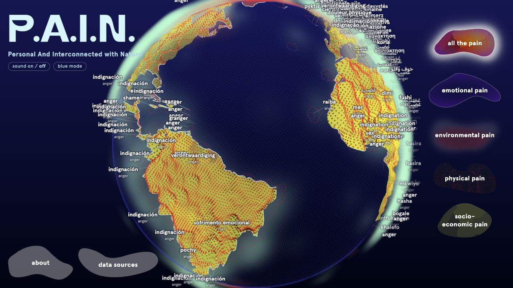

# P.A.I.N. / People, feelings, and our world

Artist-team reference | Explain it like I am five | English
Last updated: 2026-09-09. Version: 1.0.

This guide offers simple explanations for young children and **artist background** for adults.
There is no required order, activity, or wording.

The artwork is a globe with different things to notice: marks, colours, words, and lines.
It helps us think about caring for people's bodies, feelings, surroundings, and needs.

P.A.I.N. stands for Personal And Interconnected with Nature. The map's longer name is the
Personal-Planetary-Pain Map. Artist Mary Maggic leads the project with collaborators in art,
sound, design, technology, data research, and network medicine.

## Two possible beginnings

- "This globe helps us notice people and places that may need care."
- "There are different stories in this picture. Some are about bodies, some about feelings,
  and some about the world around us."

> **Artist background:** This is an artwork made from several kinds of information. It does
not measure all suffering with one ruler. The planet is not literally a person feeling pain;
the title connects human concerns with environmental change through an artistic metaphor.

# Four ways of looking

The layers are like pictures drawn on clear sheets. Each helps us notice something different.
Together they share a globe, but their information comes from different places.

| Layer | A simple meaning | Something familiar |
| Bodies | Hurt can make daily things harder. | Walking or turning your head. |
| Feelings in words | Writing can express worry, hurt, or anger. | Words in a storybook. |
| Our surroundings | Places change; activities affect the air. | Weather today, change over years. |
| Economic circumstances | One clue about available resources. | Homes, schools, and care. |

[[DIAGRAM:layers]]

## A shared idea: care has many parts

A person may need somewhere comfortable to sit and somebody who listens. A comfortable chair
does not tell us whether that person feels lonely.

> **Artist background:** The four layers are physical, emotional, environmental, and
socioeconomic. They are indicators with different units, coverage, and limitations. A bright
country is not the winner of a competition about suffering. Each view answers a narrower
question about the evidence available.

# Reading the picture

The globe is an artwork. Its marks are not real cuts; its floating shape is not photographed
smoke. Its words are clues from writing, not labels for everyone in a country.

Callouts: 1, words; 2, marked surface; 3, environmental atmosphere; 4, economic yellow;
5, layer choices. Exhibition image: 9 September 2026.

| What appears | A way to explain it |
| Dents and dots | "These marks help us notice bodily pain that we cannot always see." |
| Red atmosphere | "This part is about how temperatures have changed." |
| Pale or green atmosphere | "This part gives a shape to emissions from activities." |
| Yellow | "This colour uses one clue about a country's economy." |
| Words | "The computer found themes in writing connected with these places." |
| Lines | "These places have the same kind of word showing." |
| An empty place | "We may be missing that piece of information." |

## Movement, sound, and attention

Turning the globe lets another place come into view. Choosing a country or a word brings it
into focus. Following a moving line can help the eye find another place. The movement does
not show pain travelling from person to person.

Music and interaction sounds were made for the artwork, like music accompanying a picture
book. They are not recordings of someone hurting. Brightness can mean "look here."

> **Artist background:** Dots are not individual patients. Country symbols summarize available
signals; physical and environmental examples can emphasize a strong local signal rather than
a national average. Filters change the emotional themes allowed to appear. The underlying
texts do not change. Projection mode hides the separate web survey. Participation never
requires a visitor to tell a personal story.

# Bodies: small movements matter

Turning a page, looking over a shoulder, and walking to a friend all use the body. When a body
hurts, something ordinary can take more effort. We cannot always tell how somebody feels just
by looking at them. The artwork gives some of that hidden difficulty a visible shape.

## Different kinds of bodily pain

| Name used in the project | A simple explanation |
| Headache disorders | Problems that can make the head hurt again and again. |
| Migraine | A condition that can bring headaches and other difficulties. |
| Low back pain | Hurt around the lower part of the back. |
| Neck pain | Hurt around the part that helps us turn our head. |
| Osteoarthritis | A joint condition that can make movement sore or stiff. |
| Rheumatoid arthritis | A different illness that can make joints sore and swollen. |

Arthritis names different conditions. A joint is where bones meet, such as a knee. Children
do not need to memorize these terms or match them to their own bodies. [C3, C5-C7]

## Many people in one place

Many people living close together can mean many experiences of pain nearby. That helps
explain some strong marks around India without implying everyone has the same illness.

> **Artist background:** IHME's Global Burden of Disease supplies health estimates; WorldPop
supplies population information used in geographic placement. The exhibition has **15,282
mapped observations**, **2,547 for each of six categories**. They are neither interviews nor
patient counts; 13,183 are assigned to 155 countries. The exact health measure, reference year,
original input size, and original
release are not yet confirmed. National clinical rates cannot be read from the marks. Migraine
and the broader headache category overlap, so they cannot be added as separate people. [S7-S8]

# Surroundings: changing is different from being hot

Imagine two cups: one cold and warming, the other warm and staying the same. The second is
warmer; the first changed more. A country can also remain cold while its temperatures change.

The red part of the atmosphere helps us look at temperature change over time. It does not tell
us whether we would need a coat there today.

## Two questions about the environment

- Warming asks how temperatures have changed compared with an earlier climate.
- Emissions concern material released by activities. The artwork gives that pressure a shape.

A border is a map line, not a wall around the air. The atmosphere suggests a shared world.

> **Artist background:** Berkeley Earth supplies the temperature source, represented by **8,100
observations**. Climate TRACE supplies the emissions source, represented by **2,339
observations**. Assigned observations cover 140 temperature and 146 emissions countries.
The original release, original dataset size, comparison period, temperature
baseline, and precise emissions measure behind the selected view remain unresolved. These
counts describe selected observations, not thermometers or emitting facilities counted by
visitors. The displayed atmosphere cannot be converted into smoke height, tonnes, or what a
person breathes. [S9-S10]

> **Context:** Russia and Canada have strong warming signals in the exhibition. Climate research
describes especially strong Arctic warming, including interacting effects involving snow and
ice. This is relevant regional context, not a complete explanation of every mark. [C1]

# Yellow: one clue about economic circumstances

People need food, homes, transport, and care. Economies involve making things and providing
services. Yellow compares production in a country with its population.

More yellow means a lower number in this particular comparison. It does not tell us how kind,
happy, generous, or important the people are.

## A basket comparison, with a limit

Imagine two groups making baskets. A basket count tells us how much each group made. Comparing
it with group size asks a different question. Neither tells us who owns the baskets.

> **Artist background:** The actual measure is **World Bank GDP per capita for 2024, in current
US dollars**. GDP is economic output; per capita means divided by resident population. It is
not a household's money, a typical salary, or an equal share handed to everyone. The exhibition
roster has **190 available values and 16 missing entries**. A logarithmic visual scale keeps a
very wide range visible, but does not adjust for inequality or purchasing power. [S11]

> Burundi has strong yellow and Monaco the weakest yellow in the selected comparison. These
contrast economic output, not human worth. Luxembourg shows why averages need care:
cross-border workers help produce output while living outside the resident population used
in the calculation. [C2, C4]

# Words: shared themes, different lives

A story can describe somebody worried and lonely at once. The artwork gives one theme
prominence above a country; others may also be present in the writing.

An unfamiliar word may describe a familiar experience. Short translations help but leave
some meanings out. Many languages can be spoken within one country.

> **Artist background:** Artists choose the displayed country language; it need not match the
articles' language. The exhibition has 84 text-language hints and 101 displayed language codes.
Neither count is the classifier's 100-language design coverage.

## The fourteen broad categories

These explanations are possibilities for discussing words. They do not diagnose children,
visitors, or the people of a country.

| Category | A simple opening |
| Body pain | "Words about a body hurting." |
| Hurt | "Feeling hurt, without a more particular word." |
| Eco-anxiety | "Worry about changes to the world around us." |
| Uncertainty | "Feeling worried because we do not know what comes next." |
| Grief | "The sadness of missing someone or something important." |
| Anger | "Feeling angry, sometimes because something seems unfair." |
| Hardship | "Having a difficult time getting what is needed." |
| Displacement | "The difficulty of having to leave a familiar home." |
| Trauma | "Lasting distress after something very overwhelming." |
| Loneliness | "Wanting connection and feeling alone." |
| Depression | "A name for particular kinds of lasting emotional difficulty." |
| Fear | "Feeling afraid or very worried." |
| Helplessness | "Feeling unable to change what is happening." |
| Shame | "Feeling bad about ourselves or something we have done." |

> **Artist background:** These are simplified openings into research categories. Grief includes
distress over a changed home environment; anger includes outrage and moral injury. The
classifier's depression and trauma categories extend beyond these gentle introductions.
Examples can remain fictional; no personal disclosure or symptom discussion is needed.

## Why there are connecting lines

Imagine dots on a ball with matching word cards. Lines join nearby dots that have the same
kind of card. The lines help us see a shared theme across places. They do not mean the people
have met, feel exactly the same, or caused one another's feelings.

> **Artist background:** The current exhibition uses a **Delaunay** proximity network, a mesh
of triangles among places sharing the displayed category. **Gabriel** is the related, sparser
comparison requested for the project. Imagine a circle with two places at opposite ends of
its diameter. Another same-category place inside prevents their direct mathematical Gabriel
connection.
The globe uses the corresponding three-dimensional idea. This is geographic construction,
not evidence of social influence or a travelling emotion.

[[DIAGRAM:graph]]

## Where a country's word comes from

For news, the country is where the publisher is based. A newspaper from one place can write
about somewhere far away. Other sources carry country, location, or coordinate information.
A label on the globe therefore tells us about selected writing associated with that place.
It does not tell us how every resident feels.

> The displayed emotional selection contains **249,438 texts**: 5,000 news articles and 244,438
other texts. Where both source groups exist, it gives the news average 75 percent of the
weight and the other-text average 25 percent. Anger leads in 152 of 192 observed countries.
The newer research below is a separate analysis; it has not replaced this exhibition view.

> **Artist background:** The display chooses among fourteen distress categories. It can show
a word even when the model gives a higher score to no-pain or out-of-scope material. A visible
word therefore does not prove strong distress in the selected texts.

# The AI: learning patterns in writing

The computer learns patterns from examples made for the project, then examines other writing.
A pretend sentence about missing a friend is a possible teaching example, not real testimony.
It is made to work with writing in **100 languages**. The teaching examples use many languages too.

It is like practising with picture cards before sorting new ones. Writing can have several
themes, and the computer makes mistakes. It cannot read minds.

## Learning and using are different

Learning uses teaching examples. Applying the model examines real articles, posts, or
complaints. More analysed writing does not mean the AI learned again.

> **Artist background:** PCAI prepares country-associated texts and applies the distress
classifier. Adopted **version 9**, finalized **4 September 2026**, uses the pretrained
multilingual **BGE-M3** encoder and a smaller project-trained neural network. The encoder
represents language numerically; the smaller network links those representations with the
project's categories. It has a 1,024-unit hidden layer and 70 related decisions, including
14 broad and 47 fine categories. These are not 70 emotions. It examines at most 512 tokens,
so later parts of long articles can be missed. [S12]

| Teaching or evaluation stage | Examples | What the number means |
| Prepared synthetic collection | 573,143 | Constructed examples across 100 languages. |
| Actually used to fit the adopted model | 333,236 | The subset that taught the smaller network. |
| Clean synthetic test | 15,874 | Separate examples used to check performance. |
| Harder synthetic stress test | 10,429 | Challenging examples withheld for evaluation. |

> **Artist background:** These are different stages, not four groups to add into a total.
Broad/fine macro-F1 is **0.9028/0.7772** on the clean test and **0.6658/0.6552** on the stress
test. F1 balances finding labelled examples against false alarms; macro averages categories
equally. These synthetic-test scores are not percentages of people understood correctly.
Coverage of 100 languages does not establish equal reliability in each language.

# A very large library of news

The news collection is like a library with many shelves. Researchers check dates, reduce
repeated copies, cover some identifying details, and check publishers' countries.

The collection contains general news. An article does not have to include a word about pain
to enter it. The AI later looks for whether distress is expressed.

## Artist background: the collection's sizes

| Stage | Articles or records | Meaning |
| Stanford OVAL source | About 600 million | Approximate upstream, already cleaned and deduplicated. |
| Locally acquired snapshot | 474,985,436 | The exact snapshot counted by the project. |
| Prepared texts | 472,438,058 | After initial checks and later privacy cleaning. |
| Country-linked main corpus | 393,745,301 | Prepared articles across 186 publisher countries. |
| Recorded years 2015-2026 | 388,842,327 | A subset of that main corpus, not extra articles. |

> The main corpus also contains **4,902,974** records dated 2010-2014. The upstream description
and local snapshot are different stages; their difference is not an exact count removed by
PCAI. The source is described as multilingual, with more than 100 languages; the acquired and
prepared collections carry **116 language codes**. [S1]

> Initial checks remove **906,602 duplicates** and **1,640,769 date exclusions**. Later privacy
cleaning reveals **7 more duplicates**. Publisher-country uncertainty or conflict excludes
**78,207,037** records. Further prose/privacy/record eligibility excludes **485,075**, and
final duplication or conflict checks exclude **645**, leaving the main corpus above.

> Masking covers detected identifiers such as emails, phones, links, and handles. It often
changes a text rather than removing it and does not guarantee complete anonymity. Filtering
also affects whose writing remains. Different articles can still discuss the same event.

## Artist background: what has been classified

> The verified completed run examines **25,932,030 news articles** selected from the main corpus,
then combines them with **244,438 other texts**. Its **26,176,468 records** cover **192
countries**. The news selection aims for up to 250,000 per country; the main corpus has no
such cap. The 25.9-million selection is included within the 393.7 million, not added to it.

| Source | Completed selection | Countries | Recorded years |
| Stanford OVAL CCNews | 25,932,030 | 186 | Mostly 2017-2024. |
| Twitter Sentiment by Country | 166,837 | 163 | 2020. |
| DEMOTEC civic-participation tweets | 67,193 | 136 | 2015-2021. |
| Yachay coordinate-linked texts | 8,564 | 4 | 2014-2022. |
| CFPB consumer complaints | 1,030 | 1 | 2025. |
| CMU GeoText microblogs | 814 | 1 | 2010. |

> Country coverage overlaps. Counts are selected records, not unique people. Yachay's broader
source describes over 600,000 posts across six countries. Other smaller-source original
totals are unverified. The five smaller sources have 60, 9, 47, 2, and 8 recorded language
hints respectively, not guaranteed language accuracy. [S1-S6]

> The latest news selection has **104 language or variety hints**; **94.2 percent** of its
records are dated 2017-2024. Dates may come from publication, crawl, or substituted acquisition
metadata. The main corpus has no 2025 entries; a 2026 date alone does not prove fresh reporting.
This is not a real-time reading of national feelings.

> The completed combined research gives every record equal weight, so news contributes about
**99.07 percent** globally. Anger/moral injury leads in **178 of 192** country results. India's
latest result uses **251,442 records**, including 250,000 news articles. More records change
the evidence and its mixture; they do not automatically provide a balanced population view.

> **Status as checked on 9 September 2026:** The larger corpus supports an ongoing classification
programme. The available operational record does not establish that full-corpus production
classification has started. The completed 25.9-million news run must not be described as
completion of all 393.7 million articles.

# Country stories / Twenty-five small openings

These optional stories concern the **current exhibition**. "Strong" and "small" describe
only the named layer. Artist background separates observations from possible explanations.
Map counts are assigned observations, not patients. Physical/environmental country signals
emphasize the largest local value, not a national average.

## Story 01 / India: many lives nearby

**Simple opening:** "A big city has many people close together. That can mean many bodies
needing care in one place."

> **Artist background:** India has a strong local physical signal, including migraine-related
concentration: 266 condition-location observations, including 45 migraine observations.
Population information contributes to placement, without establishing high individual risk.

## Story 02 / Pakistan: when a headache returns

**Simple opening:** "Reading a favourite book can be harder when a headache keeps coming back."

> **Artist background:** Pakistan has some of the strongest headache-related signals. Migraine
and the wider headache category each have 13 observations. They overlap clinically and cannot
be added as separate patient counts. National causes are not established. [C7]

## Story 03 / Japan: moving with comfort

**Simple opening:** "Getting up to meet a friend uses our back as well as our legs."

> **Artist background:** Japan has a strong back-pain signal from 17 observations. In 2024,
29.3 percent of its
population was aged 65 or older. Age is relevant to global back-pain burden, but does not
establish how much it explains Japan's mark. [C3, C8]

## Story 04 / China: knees and hands

**Simple opening:** "Bending a knee and holding a cup are small movements that help with lots
of things. Some illnesses can make those movements sore."

> **Artist background:** China has strong osteoarthritis and rheumatoid-arthritis signals.
There are 135 and 137 observations respectively. These are distinct conditions; the health
estimates do not diagnose residents. [C5-C6]

## Story 05 / Egypt: turning to look

**Simple opening:** "Turning our head lets us see who is beside us. Neck pain can make that
ordinary movement difficult."

> **Artist background:** Egypt has a strong neck-pain signal from 12 observations. No specific job,
habit, or lifestyle cause has been established by the exhibition.

## Story 06 / United Kingdom: what a picture cannot show

**Simple opening:** "Someone can look fine and still have a sore body. Looking does not tell
us everything."

> **Artist background:** The United Kingdom has a strong rheumatoid-arthritis signal from
9 observations. The
condition can involve pain and swelling that limit activity. [C6]

## Story 07 / Guyana and Vanuatu: a quieter mark

**Simple opening:** "A small mark tells us about this part of the picture. There are still
many stories we cannot see."

> **Artist background:** These countries each have 12 physical observations and low signals.
That does not
mean people there rarely hurt. The layer represents selected conditions through an artistic
transformation.

## Story 08 / Russia: cold water can warm

**Simple opening:** "Cold water can get warmer and still feel cold. Places can change like
that too."

> **Artist background:** Russia has 363 temperature observations and a strong local signal.
Arctic warming research
provides relevant regional context, including interacting snow and ice effects. Russia
contains many different climates. [C1]

## Story 09 / Canada: more than today's coat

**Simple opening:** "Needing a coat today does not tell us how a place has changed over many
years."

> **Artist background:** Canada has 220 temperature observations and a strong warming signal.
It emphasizes local
change, not the same temperature increase everywhere. [C1]

## Story 10 / Uruguay: one quiet answer

**Simple opening:** "This part of the picture is quiet. Another layer can tell us something
different about the same place."

> **Artist background:** Uruguay has two temperature observations and a zero signal in this
view. The comparison's baseline is unresolved; zero here does not prove no
warming or no environmental difficulty.

## Story 11 / Iceland: a name is not a measurement

**Simple opening:** "A place's name or a snowy picture cannot tell us everything about how
it is changing."

> **Artist background:** Iceland has three temperature observations and a small signal here.
That result does not summarize its weather or wider environmental vulnerability.

## Story 12 / Russia: air has no map lines

**Simple opening:** "Our map has country lines. The air does not stop at those lines."

> **Artist background:** Russia has 273 emissions observations and a strong local signal.
These are different quantities. The local mark does not rank national totals or personal
exposure. [S10]

## Story 13 / Iran and Iraq: what activities release

**Simple opening:** "Making things and moving things can release material into the air.
This floating shape helps us notice that idea."

> **Artist background:** Iran has 22 emissions observations; Iraq has five. Both have strong
signals. The visual alone
does not identify a particular industry or facility. The cloud-like form represents
pressure; it is not a measured cloud of smoke. [S10]

## Story 14 / Guinea-Bissau: two different questions

**Simple opening:** "What a place releases and what changes around that place are two
different questions."

> **Artist background:** Guinea-Bissau has one emissions observation, near the low end.
Low observed
emissions do not establish low environmental vulnerability.

## Story 15 / Burundi: what resources can help with

**Simple opening:** "Homes, schools, and care need resources. Yellow brings one question
about resources into the picture."

> **Artist background:** Burundi has strong yellow because its GDP per person is low in this
comparison. World Bank context includes development constraints and low-productivity
agriculture. This does not measure each family's circumstances or explain each cause's
contribution. [C2, S11]

## Story 16 / Luxembourg: who helped make the baskets?

**Simple opening:** "People can travel from another place to help make things. A simple
count may leave part of that story out."

> **Artist background:** Luxembourg has weak yellow and high GDP per person. Cross-border
workers contribute to output while living outside the resident denominator. The figure is
not a typical salary or an equal amount of money belonging to each resident. [C4]

## Story 17 / Monaco: feelings are another question

**Simple opening:** "Having many things cannot tell us whether someone feels lonely."

> **Artist background:** Monaco has the weakest yellow signal and the word Hurt, from
27 news articles and 1,034 other texts. Output and themes in writing are different evidence; neither
establishes a particular resident's feelings.

## Story 18 / India: big groups and big totals

**Simple opening:** "A big group can make many baskets. The number of people in the group
also matters when we compare it with another group."

> **Artist background:** India illustrates total economic output versus output per person.
The yellow layer uses the latter. Neither quantity tells us how resources are distributed
or what proportion of people experience poverty. [S11]

## Story 19 / Yemen: an empty space

**Simple opening:** "An empty space can mean we do not have that piece of the picture."

> **Artist background:** Yemen has no GDP observation in this selected view. Missing data
cannot be treated as zero hardship. Another layer may have information for the same place.

## Story 20 / Burundi: angry about unfairness

**Simple opening:** "A character in a story might feel angry because something seems unfair."

> **Artist background:** Anger is prominent in Burundi's exhibition texts. The category includes
outrage and moral injury. The sample is **28 news articles plus 2 other texts**. It neither
characterizes the population as aggressive nor establishes national causes.

## Story 21 / Palau: one page is not a whole library

**Simple opening:** "One page cannot tell us everything in a library. A little writing
cannot tell us about everybody in a country."

> **Artist background:** Palau's Uncertainty word comes from **one news article**, with no
other-text contribution. One publisher-linked article is not a national survey or a full
picture of emotional life.

## Story 22 / Timor-Leste: one word, different stories

**Simple opening:** "Two story characters can both feel angry for different reasons."

> **Artist background:** Timor-Leste has a strong anger theme in the earlier exhibition
selection: **5 news articles plus 3 other texts**. Eight texts leave many possible contexts
open and do not establish national causes.

## Story 23 / Sao Tome and Principe: words about a changing home

**Simple opening:** "A story can describe someone worrying about changes to a place they love."

> **Artist background:** The eco-anxiety label comes from **27 publisher-linked news articles**.
It describes distress about environmental change in writing, not a climate measurement or
the percentage of residents who feel anxious.

## Story 24 / Oman: a word and a health estimate

**Simple opening:** "Writing about a sore body and gathering health information are two
ways to learn about pain."

> **Artist background:** Oman's body-pain word uses **27 news articles plus 968 other texts**.
Its physical surface uses health estimates across 36 observations. These different
measurements cannot be added as patient counts.

## Story 25 / Comoros: present in one picture

**Simple opening:** "We can have one piece of a picture and still be missing another."

> **Artist background:** Comoros has economic information but no observation in the selected
emotional collection. The source has a gap, leaving some experiences outside the artwork.

# Small words, open possibilities

Children may notice movement, a word, a sound, or a familiar place. An explanation can begin
there, without requiring a personal story or a right answer.

## Optional comparisons

- Layers: pictures on clear sheets, each showing a different kind of information.
- A model: practising with example cards before trying unfamiliar ones, while still making mistakes.
- Missing information: a missing piece of a picture, rather than an empty life.
- Sampling: a few library pages that cannot speak for all the books.
- Warming: cold water changing temperature while still remaining colder than warm water.
- Economic averages: baskets made compared with group size, without assuming equal ownership.

## A little glossary

| Word | A simple meaning |
| Globe | A round model of the world. |
| Data | Recorded information used to help answer a question. |
| Layer | One part of the picture that helps us notice something. |
| Pattern | Something we can recognize across examples. |
| Estimate | A carefully worked-out value that still has limits. |
| Category | A group used to sort related things or ideas. |
| Network | Places or points joined by connections. |
| Missing | Information we do not have in this view. |

> **Artist background:** Care and curiosity carry the explanation. Words concern texts; dots
are not patients; GDP is production; warming is change. A picture tells part of a story.

# Artist background / 100 languages

The classifier is designed to classify writing in these 100 languages. Its synthetic teaching
dataset is multilingual. The list is here for the artists; it is not a list children need to
learn. Each language name appears once, in alphabetical order down each column.

| Languages 1-25 | Languages 26-50 | Languages 51-75 | Languages 76-100 |
| Afrikaans | Galician | Latvian | Sinhala |
| Albanian | Georgian | Lingala | Slovak |
| Amharic | German | Lithuanian | Slovenian |
| Arabic | Greek | Luxembourgish | Somali |
| Armenian | Guarani | Macedonian | Spanish |
| Assamese | Gujarati | Malagasy | Sundanese |
| Azerbaijani | Haitian Creole | Malay | Swahili |
| Basque | Hausa | Malayalam | Swedish |
| Belarusian | Hebrew | Maltese | Tajik |
| Bengali | Hindi | Marathi | Tamil |
| Bosnian | Hungarian | Mongolian | Telugu |
| Bulgarian | Icelandic | Nepali | Thai |
| Burmese | Igbo | Norwegian Bokmål | Tigrinya |
| Catalan | Indonesian | Odia | Turkish |
| Cebuano | Irish | Oromo | Turkmen |
| Chinese | Italian | Pashto | Ukrainian |
| Croatian | Japanese | Persian | Urdu |
| Czech | Javanese | Polish | Uyghur |
| Danish | Kannada | Portuguese | Uzbek |
| Dutch | Kazakh | Punjabi | Vietnamese |
| English | Khmer | Quechua | Welsh |
| Estonian | Kinyarwanda | Romanian | Xhosa |
| Filipino | Korean | Russian | Yiddish |
| Finnish | Kyrgyz | Serbian | Yoruba |
| French | Lao | Shona | Zulu |

These are the language entries in the multilingual training roster and intended classifier coverage.
They do not establish equal accuracy or coverage of every dialect, script, and mixed-language form.
Norwegian Bokmål is the Norwegian entry; Chinese and Arabic each count as one broad entry.

# References and further reading

These sources support the artist background. Exhibition observations and the latest completed
PCAI research were checked for the shared factual foundation on 9 September 2026. Health and
environmental release details remain explicitly unresolved. Country context is not proof of
why a particular displayed signal has its value.

## Public datasets and model

**[S1] Stanford OVAL CCNews.** Approximate upstream size, preparation, and date distinctions.
[Source page](https://huggingface.co/datasets/stanford-oval/ccnews).

**[S2] Twitter Sentiment by Country.** Country-associated social-media source.
[Source page](https://www.kaggle.com/datasets/wjia26/twittersentimentbycountry).

**[S3] DEMOTEC participatory-budgeting tweets.** Topic-based collection, 2015-2021.
[Source record](https://zenodo.org/records/14804269).

**[S4] Yachay Seasons.** Coordinate-linked texts and broader source coverage.
[Source page](https://huggingface.co/datasets/yachay/text_coordinates_seasons).

**[S5] CFPB Consumer Complaint Database.** Consumer complaint collection.
[Source page](https://www.consumerfinance.gov/data-research/consumer-complaints/).

**[S6] CMU GeoText.** Geotagged microblog collection released in 2010.
[Source page](https://www.cs.cmu.edu/~ark/GeoText/).

**[S7] IHME Global Burden of Disease.** Health-estimation source family.
[Source overview](https://www.healthdata.org/research-analysis/gbd).

**[S8] WorldPop Global 2000-2020.** Population data family, including approximately 1 km data.
[Product overview](https://hub.worldpop.org/Global1_2000-2020).
[Population data](https://data.worldpop.org/GIS/Population_Density/Global_2000_2020_1km_UNadj/).

**[S9] Berkeley Earth.** Temperature data and product explanations.
[Data overview](https://berkeleyearth.org/data/).

**[S10] Climate TRACE.** Emissions data and definitions.
[Data downloads](https://climatetrace.org/data).
[Inventory definitions](https://climatetrace.org/faqs).

**[S11] World Bank GDP per capita.** Current US dollars; the exhibition uses 2024 values.
[Indicator](https://data.worldbank.org/indicator/NY.GDP.PCAP.CD).

**[S12] BAAI BGE-M3.** Multilingual encoder used by the classifier.
[Model overview](https://huggingface.co/BAAI/bge-m3).

## Country and health context

**[C1] IPCC AR6 Working Group I, Chapter 4.** Regional warming and Arctic amplification.
[Chapter](https://www.ipcc.ch/report/ar6/wg1/chapter/chapter-4/).

**[C2] World Bank, Burundi overview.** Context for economic development constraints.
[Country overview](https://www.worldbank.org/ext/en/country/burundi).

**[C3] WHO, Low back pain.** Condition, age patterns, and global burden, 19 June 2023.
[Fact sheet](https://www.who.int/news-room/fact-sheets/detail/low-back-pain).

**[C4] STATEC, Kaleidoscope 2006.** Cross-border workers and GDP-per-capita accounting.
[Publication](https://statistiques.public.lu/dam-assets/catalogue-publications/kaleidoscopes/Kaleidoscope-2006-EN.pdf).

**[C5] WHO, Osteoarthritis.** Condition definition, 14 July 2023.
[Fact sheet](https://www.who.int/news-room/fact-sheets/detail/osteoarthritis).

**[C6] MedlinePlus, Rheumatoid arthritis.** Immune-related inflammatory condition.
[Medical encyclopedia](https://medlineplus.gov/ency/article/000431.htm).

**[C7] WHO, Migraine and other headache disorders.** Everyday and public-health burden.
[Fact sheet](https://www.who.int/en/news-room/fact-sheets/detail/headache-disorders).

**[C8] Statistics Bureau of Japan.** Population estimates for 1 October 2024.
[Population overview](https://www.stat.go.jp/english/data/jinsui/2024np/index.html).
